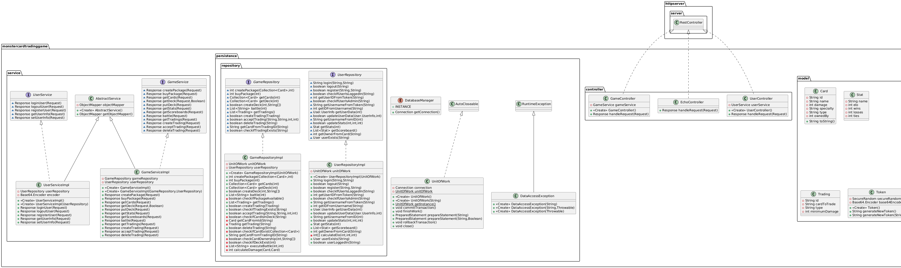

# Monster Card Trading Game (MCTG)

## Class Diagram

## GitHub Repository
[Here](https://github.com/if23b126/SEM3_SWEN_MCTG) is the link to my GitHub Repository.

## Deployment:
### 1. Docker-Compose

The docker-compose.yaml is in the [Database-Folder](/Database). After changing into the direcotry, simply enter:

    docker compose up -d

A new Container should be started with the Name: SWEN_mctg
### 2. Start Webserver

When the Docker Container is up and running, you can start the Webserver. To do so, build the Project with maven and execute the .jar file. If you're using IntelliJ, go to src/main/java/Main.java and click the Play-Button on the left Side next to the class name. 

### 3. Using the Webserver

To test the functionality, open an API testing Software of your choice and send Requests. 

## Technical Specifications

### Port
The Service will be available on port **10001**

### Methods
For all possible Request refer to the [OpenAPI specification](mtcg-api.yaml).